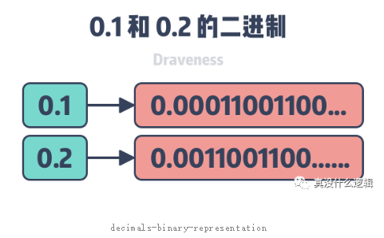
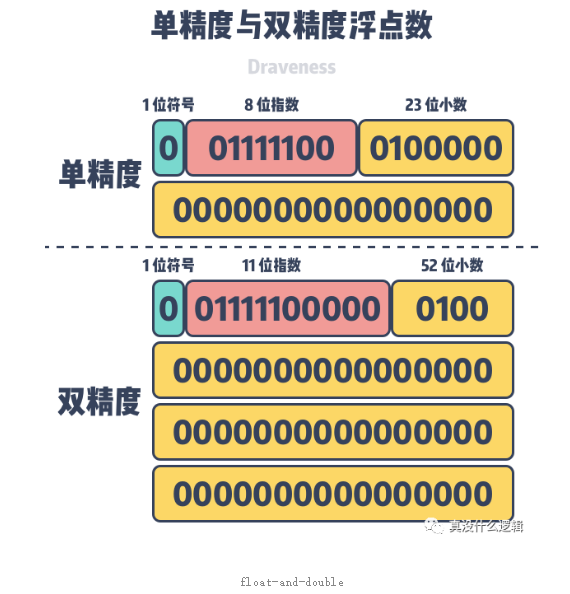
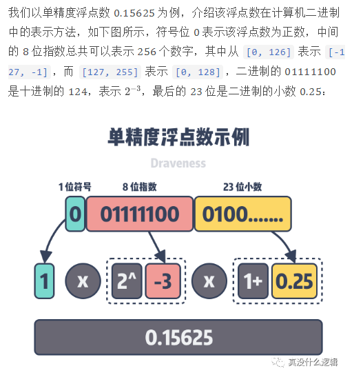
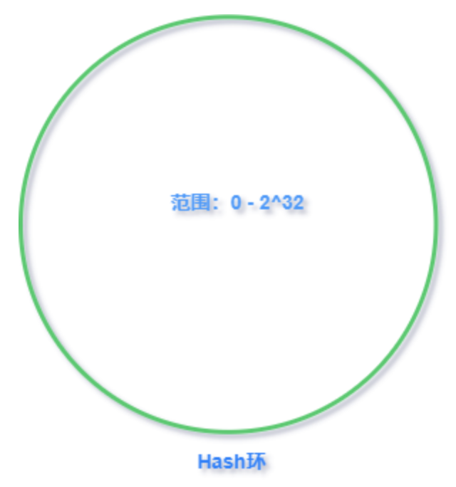
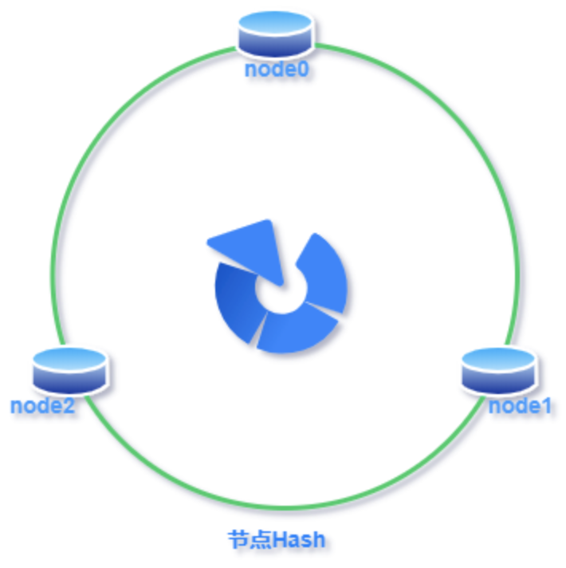
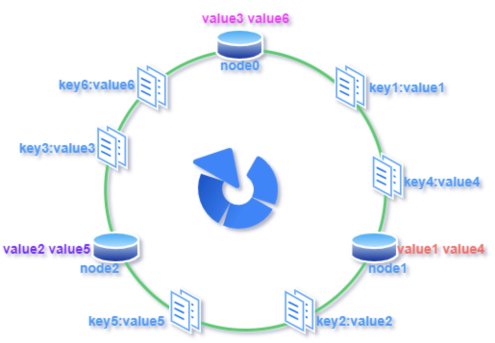
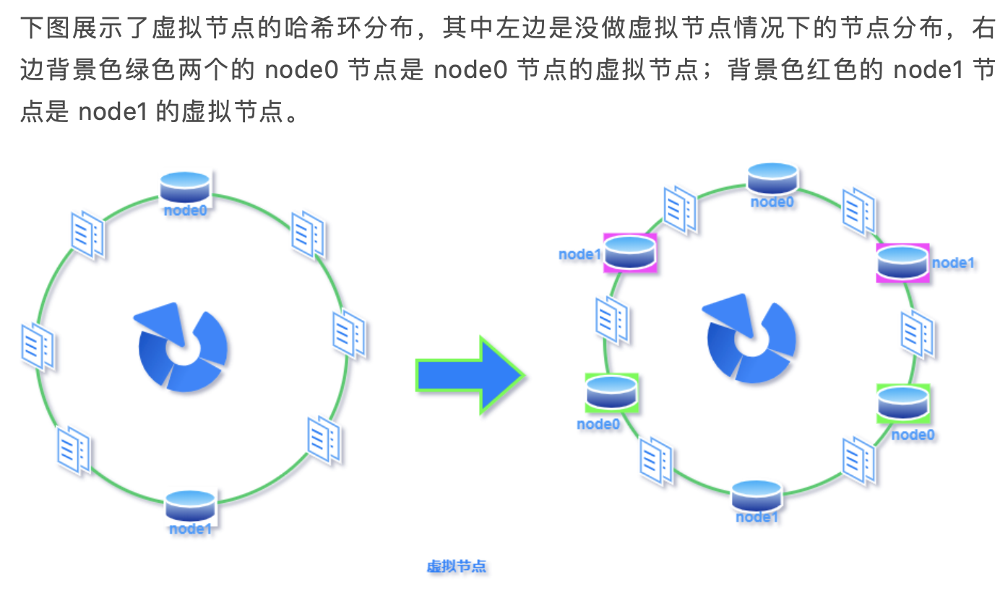

# 浮点数错误

0.1 + 0.2 = 0.3 0000 0000 0000 0004 ??? or
0.1 + 0.2 = 0.3 0000 0004 ???



* 二进制无法在有限度的长度中精确地表示十进制中的0.1和0.2；
* 单精度浮点数、双精度浮点数的位数决定了它们能够表示的精度上限。





十进制转浮点:

```
1、首先，十进制转二进制：
整数部分 除二余数倒写：
12： 12/2=6 余0 ；6/2=3 余0 ；3/2=1 余1 ；1/2=0 余1
倒写 也就是：1100
小数部分 乘二取整顺写：
0.5： 0.5×2=1.0
取整 也就是：1
12.5的二进制：1100.1
2、然后将二进制转化为浮点数：
由于12.5为正数，所以符号位为0；
1100.1=1.1001×2^3 指数为3 ，
则 阶码=3+127=130 ，即：10000010
余下的小数位为二进制小数点后面的数字，即10010000000000000000000
合起来便是：01000001 01001000 00000000 00000000
```

# hash

什么是哈希？一种数据存储，查询的方式，数据以健值对的形式存在，健通过哈希函数映射到一个确定的位置，将值保存在这个位置。查询时只需要将键作同样的哈希映射，便可以很快的找到存储的位置，是一种以空间换时间的数据存储方式。

常见的hash算法有MD5，CRC，MurmueHash等

MD5消息摘要算法（英语：MD5 Message-Digest Algorithm），一种被广泛使用的密码散列函数，可以产生出一个128位（16字节）的散列值（hash value），MD5算法将数据（如一段文字）运算变为另一固定长度值，实现在`code/echo/hash/testhash/test_md5.go`

生成的数字在传输或者存储之前计算出来并且附加到数据后面，然后接收方进行检验确定数据是否发生变化。由于本函数易于用二进制的电脑硬件使用、容易进行数学分析并且尤其善于检测传输通道干扰引起的错误，实现在`code/echo/hash/testhash/test_crc.go`

MurmurHash是一种非加密型哈希函数，与其它流行的哈希函数相比，对于规律性较强的键，MurmurHash的随机分布特征表现更良好

## 常见散列方法

* 直接定址法：取关键字或关键字的某个线性函数值为散列地址，这个线性函数的定义多种多样，没有标准
* 数字分析法：假设关键字是以r为基的数，并且哈希表中可能出现的关键字都是事先知道的，则可取关键字的若干数位组成哈希地址
* 平方取中法：取关键字平方后的中间几位为哈希地址。通常在选定哈希函数时不一定能知道关键字的全部情况，取其中的哪几位也不一定合适，而一个数平方后的中间几位数和数的每一位都相关，由此使随机分布的关键字得到的哈希地址也是随机的，取的位数由表长决定
* 折叠法：将关键字分割成位数相同的几部分（最后一部分的位数可以不同），然后取这几部分的叠加和（舍去进位）作为哈希地址
* 取模法：取关键字被某个不大于散列表表长 m 的数 p 除后所得的余数为散列地址。即 hash(key) = key % p（p<= M），不仅可以对关键字直接取模，也可在折叠法、平方取中法等运算之后取模。对 p 的选择很重要，一般取素数或 m，若 p 选择不好，容易产生冲突

## 集群负载均衡

负载均衡可以采用哈希算法将不同的请求映射到特定的服务上，从而实现负载均衡。

以取模法为例，这样的负载均衡算法有以下两个缺点

1. 扩展能力差：当服务器扩展时，不同的请求映射的节点变化很大，节点中的缓存也要随之迁移，使得代价很大
2. 缩减能力差：当业务缩减或者节点宕机时，要迁移的缓存也非常多，和扩展能力差同理

解决办法：一致性哈希算法

## 一致性哈希算法

普通取模哈希算法的改良版，哈希函数计算方法不变，只不过是通过构建环状的 Hash 空间代替普通的线性 Hash 空间

首先，选择一个足够大的Hash空间（一般是 0 ~ 2^32）构成一个哈希环



然后，对于缓存集群内的每个存储服务器节点计算 Hash 值，可以用服务器的 IP 或 主机名计算得到哈希值，计算得到的哈希值就是服务节点在 Hash 环上的位置



最后，对每个需要存储的数据 key 同样也计算一次哈希值，计算之后的哈希也映射到环上，数据存储的位置是沿顺时针的方向找到的环上的第一个节点



扩展能力和容错能力都有提升，当新增一个节点时，只会影响新节点顺时针的下一个节点的值，分一部分到新节点上来；当删除一个节点时，只需要将缓存顺延到顺时针的下一个节点即可。

## 问题：数据倾斜

较少的服务器节点聚集在哈希环的一处，这样会有大量的请求落到第一个节点上

进而造成**节点雪崩**，一个节点过载宕机之后数据又落到了下一个节点，也过载，这样下去导致整个哈希环上的节点全部崩溃。

解决办法：虚拟节点

## 虚拟机节点



## Context

控制并发时，有两种方式，一种是WaitGroup，另一种就是context

sync.WaitGroup：将一件事拆分成很多个job，最后要等到所有job执行完才可以执行主程序，这时就可以使用WaitGroup

三个关键API：`wg.Add(n)`, `wg.Done()`, `wg.Wait()`

那么如何通知子任务结束呢，例如当桌面应用点击关闭时，如何通知其他任务结束呢，可以采用`select+channel`

问题：有很多嵌套的gorutine时就很难用channel实现，可以用context实现

context工作方式：在主程序最上面宣告一个主`context.Background()`，然后在每个worker节点单独建立子上下文，这样做最主要的目的就是当关闭其中一个上下文的时候可以直接取消worker内所有的job。对比历程参见