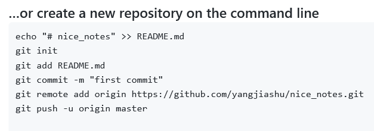

### 第一步
1. 在github网站上创建一个库
2. 创建自己的本地库
3. 添加README.md文件：`echo "# [库名]" >> README.dm`
4. add和commit
5. remote：`git remote add origin https://github.com/yangjiashu/xxx.git`
6. push: `git push -u origin master`

具体过程如图1-1所示。

注意：在remote时，用命令git remote add xxxx(origin) xxxx(网址，ssh或者http)来挂载到远程仓库，如果是http方式，则要输入账号密码来push，如果是ssh，要在主机上生成ssh密钥，然后在github站点中设置信任密钥

到此为止，第一个git项目就与远程仓库链接成功了

### 获取远程仓库的内容
#### 1. 简单方法
`git clone [url]`
#### 2. 完整方法
简单方法实际上是几个方法的集合，具体的步骤如下所示
1. mkdir xxx
2. git init
3. git remote add origin [url]
4. git fetch
5. git checkout