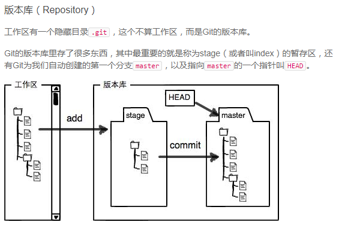

# 本地

## 版本回退

查看版本输入命令：`git log`或者简短版`git log --pretty=oneline`

查看所有命令的历史：`git reflog`

版本回退：HEAD指针指向当前版本，命令行最上面的是当前的版本HEAD,上一个版本表示为HEAD^,以此类推。要回退到某个特定的版本命令是：

`git reset --hard [版本id或者HEAD^^^]`

## 工作区和暂存区



工作区里有一个.git文件夹，这个文件夹对于工作区来说是隐藏的，成为git的版本库。版本库里存了很多东西，其中最重要的就是stage或者叫index的暂存区，还有git创建的第一个分支master，以及指向master的指针HEAD。

git add就是把文件**修改**添加到暂存区；

`git commit`就是把暂存区的所有内容提交到当前分支;

`git diff`不加参数是比较的是stage暂存区和工作空间的区别

`git diff master`查看master分支和working area的文件区别

`git diff refs/remotes/origin/master`用远程分支和当前工作区比较

`git diff HEAD -- xxxx.xxx`可以查看某个文件和某个版本的差异,同样，HEAD可以替换为commit id;

`git diff` 命令的结果：

```
---代表源文件，+++代表目标文件，通常，working area中的文件都被当作目标文件对待。
-开头的行，是只出现在源文件中的行，+开头的行，是只出现在目标文件中的行。
空格开头的行，是源文件和目标文件中都出现的行。
差异按照差异小结进行组织，每个差异小节的第一行都是定位语句，由@@开头，@@结尾。
@中包括的语句意思是：（@@ -4,6 +4,7 @@)为例，为从源文件第4行开始的6行和目标文件的第4行开始的7行构成一个差异小节。
```

## 撤销修改

`git checkout -- file`可以撤销工作区的更改。

`git checkout -- readme.txt`的意思是，把文件在工作区的修改全部撤销，如果readme.txt没有放到暂存区stage，那么撤销修改就撤回到和版本库一样。

如果readme.txt已经添加到暂存区，又作了修改，那么修改就回到暂存区的状态。相当于checkout会先尝试回到stage状态，如果stage没有存储修改，那么回到branch中的状态。

`git reset HEAD <file>`可以把暂存区stage的修改撤销掉（unstage），重新放回工作区。注意它跟版本回退的区别，版本回退是`git reset --hard HEAD^^`是直接将工作区变成某个历史版本的状态

`git reset`既可以回退版本，也可以把暂存区的修改回退到工作区。加`--hard`表示工作区也回退，不加`--hard`表示只清空stage

## 删除文件

在git中，删除也是一个修改操作。

# 远程仓库

第一步：创建ssh key，在用户home目录下，查看.ssh目录，如果有，那么查看有无`id_rsa`和`id_rsa.pub`文件，如果没有，则创建：`ssh-keygen -t rsa -C "1098325805@qq.com"`

# 分支管理

## 创建和合并分支

HEAD严格来说不是指向提交，而是指向master，master才是指向提交的。

创建了一个新的分支dev，实际上就是创建了一个新的指针。

命令：

首先，创建一个dev分支，然后切换到dev分支
`git checkout -b dev`

用`git branch`查看当前分支。

