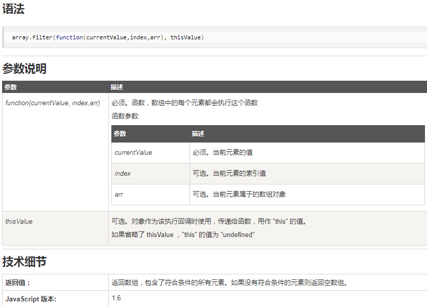

# 强制转换

## Number()

可以将任意类型转换为数值型，如果转换失败，则结果为NaN，undefined也转换为NaN，空自负转转换为0，null转换为0

parseInt比Number()要不严格，'43cat'可以通过parseInt()转换成43

Number()传入对象时，调用过程如下所示

```javascript
if (typeof obj.valueOf() === 'object') {
    Number(obj.toString());
} else {
    Number(obj.valueOf());
}
```
toString()和valueOf()方法都可以自定义，valueOf方法默认返回对象本身，所以一般都会执行toString()作为最后的Number()方法参数

## String()

原始类型值直接转换为本身 undefined->"undefined" null->"null"

对象：String({a: 1}) // "[object Object]", String([1, 2, 3]) // "1,2,3"

跟Number一样，但是是先调用toString()方法再调用valueOf()方法，换句话说，Number和String实际上都不能直接转换对象，需要转换成原始类型再转换为对象

## Boolean()

undefined, null, 0, NaN, ''转换为false，其他的都是true，所有的对象都转换为true，包括false的包装类对象，也转换为true

# 自动转换

将一个表达式转换为布尔值，`expression?true:false`, `!!expression`

# 变量声明

js会自动将变量声明提升到代码块的头部

```javascript
if (!x) {
    var x = {};
}
// 等同于
var x;
if (!x) {
    x = {};
}
```

为了避免出问题，最好把变量的声明都放在代码块的头部。

另外，函数都应该在使用之前定义。函数内部的变量声明，都应该放在函数的头部。

switch...case结构可以用面向对象结构代替。

# 面向对象

javascript的面向对象是基于构造函数和原形链的，构造函数有两个特点

* 函数体内部使用了this关键字
* 生成对象的时候，必须使用new命令

如果调用构造函数时没有使用new关键字，那么就变成了一个普通函数，这时函数里面的this就变成了全局对象，会出现意想不到的结果

## new命令的原理

1. 创建一个空对象
2. 空对象的原型指向构造函数的prototype属性
3. this指向这个空对象
4. 执行构造函数的代码

构造函数return语句要跟一个对象，如果后接的不是对象或者没有return语句，会默认返回this

## Object.create()

可以根据一个现有对象创建另一个对象，不需要使用构造函数

## this关键字

不管什么场合，this总返回一个对象，this就是属性或方法“当前”所在的对象，也就是直接调用者。

函数调用时使用`函数名.call(obj)`方法可以将this绑定到obj对象上。

`函数名.apply(obj,[args])`和call一样，只是函数参数必须放在数组里。

`函数名.bind(obj)`可以只绑定对象但是不执行。

# 异步

## 异步操作的几种模式

1. 回调
2. 时间监听
3. 发布/订阅模式，观察者模式

## setTimeout和setInterval

## Promise

# filter和map


