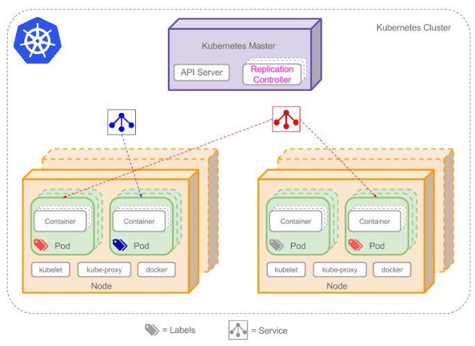

# 什么是Kubernetes?

是自动化容器操作的开源平台，所谓的操作，包括部署、调度和节点集群的扩展。使用Kubernetes可以：

* 自动化容器的部署和**复制**
* 随时扩展或收缩容器规模
* 将容器组织成**组**，并且提供容器间的**负载均衡**
* 很容易的升级应用程序容器的新版本
* 提供容器弹性，如果容器失效就替换它

Kubernetes是一次性部署多层容器（前端、后台）的完整集群

# 集群

是一组节点，服务器或虚拟机，在这之上安装了Kubernetes平台

# Pod

Pod安排在节点上，包含一组容器和卷。同一个Pod的容器共享一个网络命名空间，可以使用localhost互相通信，是短暂的。

持久化要使用卷类型，使用Replication Controller就不用手动创建Pod，可以直接用模板拷贝，使用Service可以解决IP地址改变的问题。

# Label

label是一个标记Pod的数据结构，可用于区分该Pod属于某个应用的某一部分。

使用Selectors选择带有特定Label的Pod，并且将Service或者Replication Controller应用到上面。

# Replication Controller

确保任意时间都有任意数量的Pod副本在运行。

创建Replication Controller时，需要指定两个东西

1. Pod模板：用来创建Pod副本的模板
2. Label：Replication Controller需要监控的Pod的标签

# Service

Service是定义一系列Pod以及访问这些Pod的策略的一层抽象。

# Node

物理或者虚拟机器，通常包含，Kubelet：主节点代理；Kube-proxy: Service使用其将连接路由到Pod；Docker或Rocker：使用容器技术来创建容器。

[参考教程](http://www.dockone.io/article/932)

<http://www.dockone.io/article/932>

