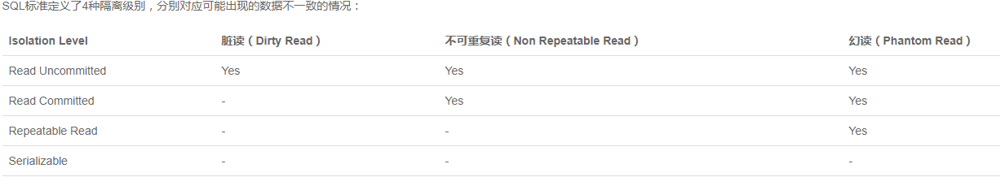
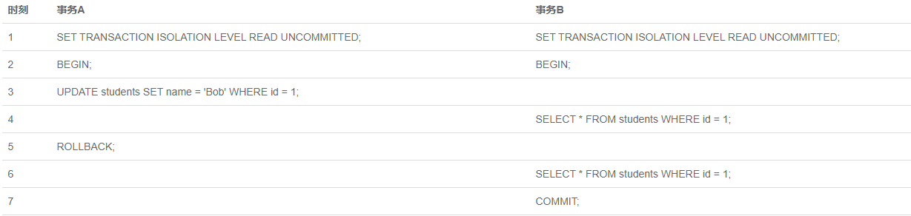
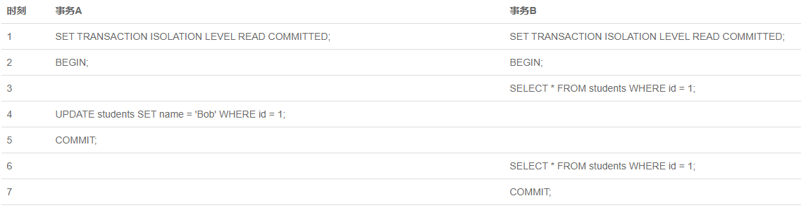
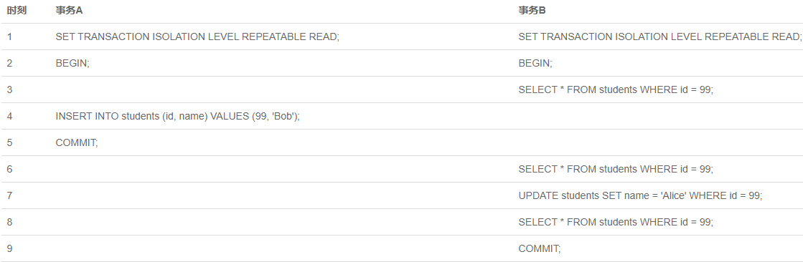

### 常用命令

初次安装完成会生成：

1. 默认一个名为postgres的数据库。
2. 一个名为postgres的数据库用户。
3. 一个名为postgres的linux系统用户。

**使用postgres用户，来生成其他用户和新数据库**

使用PostgreSQL控制台

先创建一个linux新用户

`sudo adduser dbuser`

然后，切换到postgres用户。

`sudo su - postgres`

登陆PostgreSQL控制台

`psql`

相当于用户postgres以同名数据库用户的身份，登陆数据库，这里不用输入密码。首先要做的事是使用`\password`命令，为postgres用户设置一个密码。

`\password postgres`

然后创建数据库用户dbuser，并设置密码。

`create user dbuser with password 'password';`

创建用户数据库，这里为exampledb，指定所有者为dbuser。同时要赋予其权限。

```sql
create database exampledb owner dbuser;
grant all privileges on database exampledb to dbuser;
```

最后使用`\q`命令退出控制台。


**登陆数据库**

`psql -U dbuser -d exampledb -h 127.0.0.1 -p 5432`

输入上面的命令后，系统会提示输入dbuser用户的密码。

简写：如果当前linux用户，同时也是postgresSQL用户，则可以省略用户名。如果PostgreSQL内部还存在与当前系统用户同名的数据库，则连数据库名也可以省略。

**控制台命令**

```
\h: 查看SQL命令的解释。
\?: 查看psql命令列表。
\l: 列出所有数据库。
\c [name]: 链接其他数据库。
\d: 列出所有table。
\d [name]: 列出某一张table。
\du: 列出所有用户。
\e: 打开文本编辑器。
\conninfo: 列出所有连接信息。
\q: 退出。
```

### Mysql

### window

在根目录下创建my.ini文件夹，输入

```
[client]
# 设置mysql客户端默认字符集
default-character-set=utf8
 
[mysqld]
# 设置3306端口
port = 3306
# 设置mysql的安装目录
basedir=C:\\web\\mysql-8.0.11
# 设置 mysql数据库的数据的存放目录，MySQL 8+ 不需要以下配置，系统自己生成即可，否则有可能报错
# datadir=C:\\web\\sqldata
# 允许最大连接数
max_connections=20
# 服务端使用的字符集默认为8比特编码的latin1字符集
character-set-server=utf8
# 创建新表时将使用的默认存储引擎
default-storage-engine=INNODB
```

初始化`mysqld --initialize --console`

复制初始密码

执行`mysqld install`

执行`net start mysql`

登陆`mysql -u root -p`

输入密码

更改密码

`ALTER user 'root'@'localhost' IDENTIFIED BY '你的密码';`

# SQL学习

## 联合主键

允许有一列重复，只要不是联合逐渐全部重复就行

## 主键

不要选择业务相关的主键

类型最好是`BIGINT`或者`GUID`类型，同时也不能为空

## 外键

在表字段最后添加，格式：

```
constraint [约束名]
    约束内容

constraint students_classes_id_fk
    foreign key (class_id) references classes (id)
```

## DDL

`alter table`, `drop constraint`, `drop column` `add constraint`

## DQL

逻辑运算符: `not`, `and`, `or` 优先级从高到低

`=`, `>`, `>=`, `<>`

比较运算符也可以和字符串比较，字符串要用单引号''包裹起来

模糊查询：`like`关键字，`%`表示0个或多个字符, `_`表示任意单个字符, `[]`表示匹配括号里的**一个**，不能是多个，也不能一个都没有, 且01234可以用0-4表示，abcde可以用a-e表示, `[^]`表示不在括号中的字符,表示出了括号内的**任意一个**字符

`in (...)`表示在**集合**中查询，集合中是点。

`between m and n`表示在**区间**中查询，表示一个闭区间。

## 投影查询

查询时不是所有列，而只包含指定列的查询叫投影查询

## 排序

`order by`子句可以对查询结果排序，`order by xxx desc`可以以倒序查询,且排序的列可以不止一个

`order by`子句要放在`where`后面

## 分页查询

`limit <m> offset <n>`可以实现分页查询, 表示跳过n条记录查询最多m条记录(有m条就查m条，到末尾没有m条时就查询所有记录)

如果offset太大，超过了表长时会返回空数据而不是报错

offset越大效率越底

简写模式`limit n, m`，顺序反过来了


## 聚合查询

要使用聚合函数，一般有`count(field)`, `avg()`, `max()`, `min()`, `sum()`, 可以给聚合函数查询结果取别名, `ceiling`，`floor`分别表示向上取整和向下取整

一般和select, group by的having子句配合使用

## 分组

分组查询也一般是和聚合函数配合


## 事务

事务的ACID

1. Atomic，原子性，要么全部执行，要么全部不执行
2. Consistent，一致性，事务完成后，所有数据的状态都是一致的，符合逻辑的
3. Isolation，隔离性，如果有多个事务并发执行，每个事务作出的修改必须和其他事务隔离
4. Duration，持久性，对数据的修改会持久化到数据库中

单条sql会默认当成一个事务处理，称之为隐式事务

显示事务用`begin`开始, `commit`提交

主动让事务失败，可以在最后调用`rollback`

### 隔离级别



**Read uncommitted**

隔离级别最低的一种事务级别，会读取其他事务修改但未提交的记录，当其他事务回时，那么读到的数据就是脏数据(dirty read)

设置语句`set transaction isolation level read uncommitted`



**Read committed**(很多数据库默认)

可能会出现不可重复读(Non repeatable read), 因为隔离级别是只能读已经提交的修改，但是在出现修改语句之前是可以读的，所以修改了之后又commit了，读的数据就和原来不一样了



**Repeatable read**(mysql InnoDB默认)

可能会出现幻读的问题(phantom read),在我们使用RR的时候,事务启动会创建一个read-view，之后其它的事务修改了数据，这边看到的仍然和开始时一样，所以在RR隔离级别下事务不受外界影响



**Serializable**

最高级别的隔离，所有事务按照次序依次执行，安全性很高，但是效率比较低