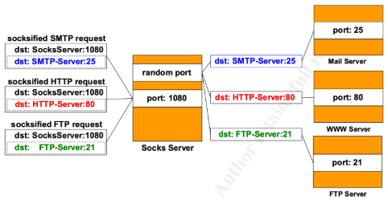

# socks5

1.在客户端请求服务器连接时要发送一个方法选择报文

> |VER | NMETHODS | METHODS  |
> +----+----------+----------+
> | 1  |    1     | 1 to 255 |
> +----+----------+----------+

METHODS是客户端支持的认证方法，取值为
* `0x00` 不需要认证
* `0x01` GSSAPI
* `0x02` 用户名/密码认证
* `0x03-0x7F` IANA ASSIGNED
* `0x80-0xFE` 保留的私有方法* 0xFF 没有可用的方法

2.服务端要返回一个报文，从方法里筛选要用的认证方法

> +----+--------+
> |VER | METHOD |
> +----+--------+
> | 1  |   1    |
> +----+--------+

METHOD里填写要使用的认证方法，如果是0xff，表示客户端提供的方法服务端都不能接受，客户端必须关闭连接

3.客户端告知目标地址

> +----+-----+-------+------+----------+----------+
> |VER | CMD |  RSV  | ATYP | DST.ADDR | DST.PORT |
> +----+-----+-------+------+----------+----------+
> | 1  |  1  | X'00' |  1   | Variable |    2     |
> +----+-----+-------+------+----------+----------+

* `VER`还是版本，取值`0x05`
* `CMD`是指要做啥，取值如下
  * CONNECT `0x01` 连接
  * BIND `0x02` 端口监听，在server上监听一个端口
  * UDP ASSOCIATE `0x03` 使用UDP
* `RSV`是保留位
* `ATYP`是目标地址类型，取值为
  * `0x01` IPv4
  * `0x03` 域名
  * `0x04` IPv6
* `DST.ADDR` 就是目标地址的值，如果是IPv4，那么就是4字节，如果是IPv6，那么就是16字节，如果是域名，那么第一个字节表示接下来有多少个字节表示目标地址
* `DST.PORT`两个字节表示端口号

4.服务端回复

> +----+-----+-------+------+----------+----------+
> |VER | REP |  RSV  | ATYP | BND.ADDR | BND.PORT |
> +----+-----+-------+------+----------+----------+
> | 1  |  1  | X'00' |  1   | Variable |    2     |
> +----+-----+-------+------+----------+----------+

* `VER`还是版本
* `REP`是状态码，取值如下
  * `0x01` successed
  * `0x01` general SOCKS server failure
  * `0x02` connection not allowed by ruleset
  * `0x03` Network unreachable
  * `0x04` Host unreachable
  * `0x05` Connection refused
  * `0x06` TTL expired
  * `0x07` Command not supported
  * `0x08` Address type note supported
  * `0x09 to 0xff` unassigned
* `RSV` 保留位
* `ATYP` 目标地址类型，和客户端报文取值一样
* `BND.ADDR` 服务器绑定得知
* `BND.PORT` 服务器绑定的端口

